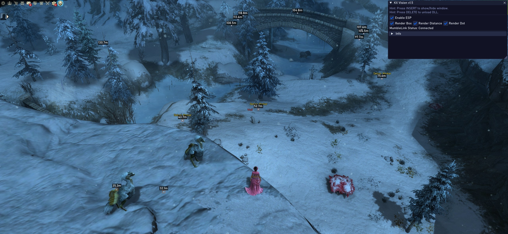

# KX-Vision for Guild Wars 2

**Educational Purpose Only:** This project is developed solely for educational purposes, allowing developers to learn about game rendering concepts, memory manipulation, and MumbleLink API integration in Guild Wars 2.

## Overview

KX-Vision is an open-source ESP (Extra Sensory Perception) overlay for Guild Wars 2 that uses the officially supported MumbleLink API to gather positional data. It's designed as a learning platform for developers interested in:

- Real-time overlay rendering with ImGui and DirectX 11
- Processing MumbleLink data for spatial awareness
- 3D-to-2D coordinate projection techniques
- Clean software architecture for game overlays
- Implementing safe, non-invasive tools that survive game patches

## Features

- **MumbleLink Integration:** Utilizes Guild Wars 2's officially supported MumbleLink API for obtaining player position and game state
- **Visual ESP Features:**
  - Agent box rendering with distance-based scaling
  - Distance measurements
  - Position indicators
  - Automatic color coding based on distance
- **Minimalist UI:** Simple, configurable interface with essential controls
- **Patch-Resistant:** Designed to withstand game updates by avoiding direct memory manipulation
- **Developer-Friendly Architecture:** Well-structured, documented code designed for extension and learning

## Educational Focus

This project is intended as a learning resource for developers interested in:

1. **Game Integration Techniques:** Understanding how to safely interact with games using supported APIs
2. **3D Math in Game Development:** Learning about world-to-screen projections and coordinate systems
3. **DirectX & ImGui:** Implementation of overlays using modern rendering techniques
4. **Clean Architecture:** Study a well-structured approach to modular C++ application design

## Technical Implementation

KX-Vision is built with several key technologies:

- **DirectX 11:** For rendering the overlay
- **ImGui:** For user interface components
- **MumbleLink API:** For retrieving player position and game state data
- **GLM:** For 3D math operations
- **MinHook:** For function hooking when necessary
- **SafetyHook:** For safe memory manipulation techniques

## Building

### Prerequisites

- **Visual Studio:** 2019 or newer
- **Windows SDK:** 10.0.19041.0 or newer
- **C++17 Support**

### Build Instructions

1. Clone the repository:
   `ash
   git clone https://github.com/Krixx1337/kx-vision.git
   cd kx-vision
   `

2. Open KX-Vision.sln in Visual Studio

3. Set the configuration to Release | x64

4. Build the solution (F7 or Build → Build Solution)

5. Find the output DLL in the x64/Release directory

## Usage for Educational Purposes

1. Launch Guild Wars 2
2. Inject the DLL using a tool like Process Hacker or Xenos
3. Use INSERT key to toggle the overlay window
4. Configure ESP options through the UI
5. Press DELETE to safely unload the DLL

## Architecture for Developers

The codebase is organized into several key components:

- **ImGuiManager:** Handles all UI rendering and user interaction
- **ESPRenderer:** Responsible for ESP visualization logic
- **Camera:** Processes MumbleLink data and handles view/projection matrices
- **HookManager:** Manages DirectX function hooks for drawing
- **ESP_Helpers:** Utility functions for world-to-screen projections

## Extending the Project

Developers looking to learn from and extend KX-Vision might consider:

1. **Adding New Visualization Types:** Implement new types of ESP markers or information displays
2. **Enhancing Filtering:** Add more sophisticated filtering of what entities to display
3. **UI Improvements:** Extend the UI with additional configuration options
4. **Performance Optimization:** Study and improve the rendering performance
5. **Alternative Data Sources:** Explore additional APIs Guild Wars 2 might expose

## Community & Contributions

This is an educational open-source project, and contributions that enhance its value as a learning resource are welcome!

- **Documentation:** Improvements to comments, explanations, or additional tutorials
- **Code Quality:** Refactoring, optimization, and architectural improvements
- **Features:** New educational features that demonstrate important concepts

## Disclaimer

This software is created and released for **EDUCATIONAL PURPOSES ONLY**. The use of KX-Vision may be against the Guild Wars 2 Terms of Service. The developers and contributors are not responsible for any consequences that may arise from using this software in violation of the game's terms.

**Please use responsibly:**
- Only use for learning about game development concepts
- Do not use in competitive environments
- Be aware of ArenaNet's policies regarding third-party tools

## License

This project is licensed under the MIT License - see the [LICENSE](LICENSE) file for details.

## Credits

- Initial concept and development by Krixx
- Uses [Dear ImGui](https://github.com/ocornut/imgui)
- Uses [MinHook](https://github.com/TsudaKageyu/minhook)
- Uses [SafetyHook](https://github.com/cursey/safetyhook)
- Uses [GLM](https://github.com/g-truc/glm)

## Links

- 🌐 **Website:** [kxtools.xyz](https://kxtools.xyz)
- 💬 **Discord:** [Join Server](https://discord.gg/z92rnB4kHm)
- 📚 **GitHub:** [Repository](https://github.com/Krixx1337/kx-vision)
